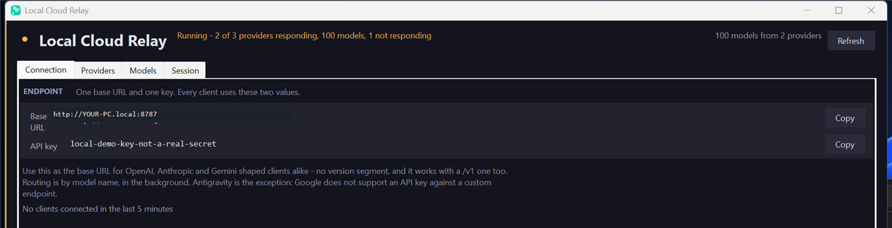
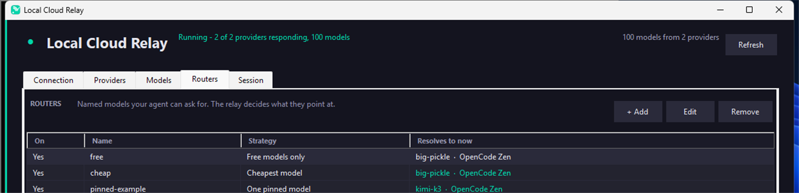
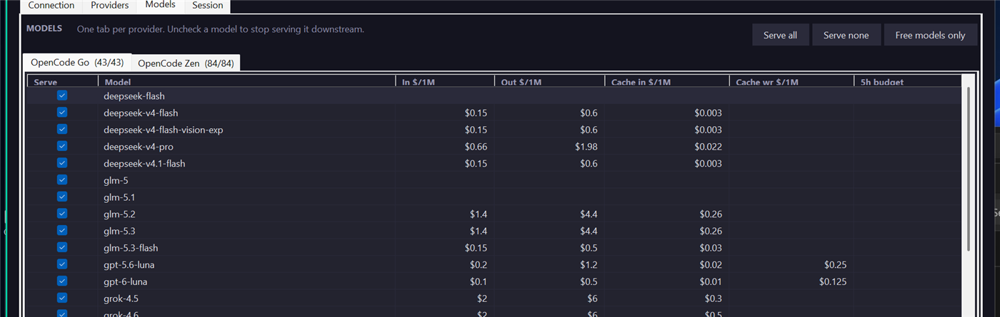

<h1 align="center">Local Cloud Relay</h1>

<p align="center"><b>One base URL and one key for every LLM client on your LAN.</b></p>

<p align="center">
  <a href="https://github.com/anshusangita08/LocalCloudRelay/releases/latest"></a>
  <a href="https://github.com/anshusangita08/LocalCloudRelay/actions/workflows/release.yml"></a>
  
  
  <a href="LICENSE"></a>
</p>

<p align="center">
  <a href="#install">Install</a> ·
  <a href="#the-five-tabs">Tabs</a> ·
  <a href="#account-providers">Accounts</a> ·
  <a href="#routers-one-name-your-models-your-rules">Routers</a> ·
  <a href="#point-a-client-at-it">Clients</a> ·
  <a href="#security">Security</a> ·
  <a href="#credits">Credits</a>
</p>

A self-contained Windows app that sits in front of the LLM gateways you already pay
for. Point Claude Code, OpenCode, Cline, Aider, Cursor or any OpenAI-compatible tool at
this machine with a single key, and it routes each request to whichever upstream serves
the model you asked for. Your upstream keys never leave the relay.

<p align="center">
  
</p>

---

## Why

Every client wants its own base URL, its own key field, and its own idea of whether to
append `/v1`. Keep four agents pointed at four gateways and you will eventually edit the
wrong one at the wrong time, paste a production key into a config you commit, or wonder
which of them is actually answering.

This collapses that to two strings, and shows you what your upstreams cost without
making you open four dashboards.

- **One endpoint, one key.** No per-agent config table. OpenAI, Anthropic and Gemini
  shaped clients all work against the same string, because the relay normalizes the
  path each of them produces — and **bridges the two API dialects**, so a Claude-shaped
  client reaches an OpenAI-only gateway and an OpenAI-shaped client reaches an
  Anthropic-only one.
- **Route by model, in the background.** You never pick a provider. Add as many as you
  like; the relay merges their model lists and resolves each request.
- **See what is up.** Every provider shows whether it answered and how many models it
  offered, so a dead gateway is visible rather than mysterious.
- **Live prices, per plan.** One button pulls current per-model rates from the public
  models.dev database — the same source OpenCode publishes from.
- **Switch individual models off.** A model you switch off leaves `GET /v1/models` and
  is refused with a `400` that lists what is available.
- **Transparent.** Streaming, tools, `cache_control`, thinking blocks and provider
  metadata pass through untouched. Same-dialect requests are forwarded byte-for-byte;
  cross-dialect requests are bridged via the Anthropic ↔ OpenAI translator.

## Install

Download `LocalCloudRelay-<tag>-win-x64.zip` from
[Releases](../../releases), unzip, and run `LocalCloudRelay.exe`. **No .NET runtime is
required** — it is a single self-contained file, ~61 MB.

Windows only. Requires Windows 10/11 x64.

The relay starts listening on port `8787` and stays in the tray; click the tray icon to
raise the window. On first launch Windows will ask whether to allow it on the network.

### First run, in about a minute

1. Launch it. A local API key is created immediately, before you configure anything.
2. **Providers → + Add**, and pick a preset — OpenCode Zen, OpenCode Go, Ollama,
   LM Studio or LiteLLM. Or **Discover endpoints** in the tray menu, which imports
   endpoints your tools are already pointed at by reading their config files. Discover
   is read-only: it never writes to them.
3. Models and prices refresh by themselves on launch and every 6 hours while the relay
   runs (never opening a sign-in window); the header shows `prices as of` the last
   update. **Refresh all** at the top does the
   same at any time: every provider's live model list (account catalogs included), current
   rates, status and ledger. Each provider then reports `ok · N models · M ms`, or why it failed.
4. Copy the base URL and API key from **Connection** into your client.

Apart from that launch refresh, nothing on the page updates on its own. Press **Refresh all**. That is deliberate — it is a
patch panel, not a dashboard.

## The five tabs

**Connection** — the base URL and the local key, each with a `Copy` button, the count of
distinct clients seen in the last five minutes, and the one caveat that matters.

**Providers** — one row per provider: on/off, name, type, model count, live status, and
base URL. Actions are **+ Add**, **Edit** and **Remove**, nothing else per provider.
Editing applies to the running relay without a restart; editing an account provider also
re-checks its sign-in (a browser opens only if needed) and re-imports its models.

**New models** — the relay remembers every model each provider has listed, across
launches, in `known-models.json`. When a refresh finds a model that was not there
before, it is **switched off** (never served by default), marked `NEW` in the Models tab's
`New` column, counted as `N new` on the provider's row and its Models tab, and named in
the status line ("2 new models (OpenCode Zen 2), switched off until you turn them on").
Ticking or unticking the model, or a Serve all / Serve none / Free models only on its
tab, clears the flag. A provider's first listing is its baseline, so adding a provider
flags nothing.

**Models** — one tab per provider, labelled `served/total`. This is the catalogue: what
is available and what it costs. Untick `Serve` to stop serving a model, and the tick is
applied in place — your sort order and scroll position survive it, so you can sort by
price and then work down the list. The three buttons act on the selected tab and
**confirm before switching anything off**, naming how many models are affected — "Free
models only" on a provider with two free models out of thirty switches off twenty-eight,
and there is no undo.

**Routers** — names your agent can ask for, where the relay decides what they point at.
See below.

**Session** — totals for the relay, then the same numbers broken down per model. What
you actually spent lives here, measured from your own traffic. **PLAN ALLOWANCES** below
lists every served model with a published request allowance (OpenCode Go's 5-hour
table): used, allowed and the share left, most used first. Routing steps a model aside at
90% used, and among otherwise equal choices prefers the model with more left.
**HISTORY** at the bottom sums today, the last 7 days and the last 30 days from
per-day files that survive restarts: requests, failures, tokens, cache hit, API equiv.
and cost. It is read on launch and on **Refresh all**.

## Account providers

A provider does not have to be an API key. **Providers → + Add** asks two things: which
provider, and whether to **sign in with your account** or **use an API key**. Press
**Sign in** and the relay does the rest: the browser opens for the login, the account
is saved, and its models are imported, ready to tick into a router. No terminal opens.
Each entry is one account, so you can add several accounts for the same vendor.

| Choice | Sign in | Models | Requests go through |
|---|---|---|---|
| **ChatGPT / OpenAI** | ChatGPT-plan sign-in in the browser. The first sign-in registers this app. | Fetched from the account, newest models included. | OpenAI Responses API, translated to and from the client's dialect, streaming included. |
| **Claude** | Claude subscription sign-in in the browser, run through the installed `claude` CLI with no window. | The CLI cannot list models. **Refresh all** resolves its `fable`, `opus`, `sonnet` and `haiku` aliases to exact ids and adds every Claude model models.dev lists. | A `claude` process kept per conversation, in stream-JSON mode. |
| **Gemini** and **Antigravity** | Google sign-in in the browser, run through the installed `agy` CLI with no window. | `agy models`, every family it lists. | An `agy` process kept per conversation, in stream-JSON mode. |

Account traffic is a subscription, so it is recorded as **$0 spent** with cost source
`plan`. What the same usage would have cost at the vendor's published API rate (OpenAI,
Anthropic and Google from models.dev) is kept apart, in the Session tab's **API equiv.**
column and the ledger's **Plan API equiv.**, and never added to Cost.

**The client gets the CLI's real token counts.** Claude Code and the Gemini CLI report
usage at the end of each turn; the relay passes it on, in the final `message_delta` of an
Anthropic stream, as a usage-only last chunk of an OpenAI stream, and in buffered replies.
Claude Code reads these numbers to track how full its context is and when to compact.
The counts include the CLI's own system prompt, which really is part of the context. agy
reports no counts, so Antigravity replies still say zero.

**CLI accounts answer text only.** The CLI runs its own agent loop, so a client's tool
definitions cannot be passed to it. Coding agents (Claude Code, Codex, OpenCode) send tools
on every turn, so routers leave CLI-account models out of such requests and pick a capable
model from the same pool (`x-relay-decision` says `text-only account, request uses tools`).
Asked for directly with tools, a CLI-account model answers 400 saying why. Plain chat
clients without tools use them as before.

**CLI processes stay up for the conversation.** Starting `claude` or `agy` costs
seconds, and agy loads about 12k tokens of agent setup each time. The relay keeps one
process per conversation and sends each new turn into it, so the CLI keeps its context
and prompt cache. Measured on a second turn: agy 12.6 s → 2.3 s, Claude Code 4.1 s →
3.3 s. A process is reused only when the request repeats exactly what it has seen and
adds new user messages; an edited history, another system prompt or model, an error or a
disconnect starts a fresh one. Idle processes stop after 10 minutes, at most four stay up
per CLI, and all stop with the relay.

**Gemini with a Google account goes through Antigravity.** Google no longer accepts the
Gemini CLI's personal sign-in; it answers "This client is no longer supported for Gemini
Code Assist for individuals" and points to Antigravity, which serves the Gemini models.
A Gemini API key still works directly. Google desktop OAuth with your own client ID and
the Gemini CLI remain available under **Advanced** for setups that still allow them.

**Edit** re-checks a saved account's sign-in, and **Refresh all** re-imports every
account's catalog without opening a sign-in window. OAuth sign-in uses PKCE and a callback bound to `127.0.0.1` only. OAuth tokens
are stored with DPAPI, like API keys. CLI credentials stay in the CLI's own store; the
relay never copies them. Checking an Antigravity account sends one tiny request, because
`agy` has no status command.

Limits to know:

- **CLI providers are agent runtimes, not raw APIs.** Claude Code and Antigravity run a
  full agent per conversation. Behaviour differs from a plain Messages API call, and
  they accept text only: no client tools, no images.
- **Antigravity tool actions follow the CLI's own permission settings.** The CLI has no
  per-request switch that disables tools. The relay runs it in a temporary working
  directory, which narrows scope but does not guarantee tools are off.
- **Personal Antigravity sign-in through a third-party tool is against Google's terms.**
  It is included at the owner's request and may stop working.
- **An auth failure never falls back to another account or key.** You see the error
  instead of a bill on a credential you did not pick.
- **Live sign-in has only been tested with fakes.** Automated tests cover every path, but
  a real account round trip still needs a manual check per provider.

## Routers: one name, your models, your rules

A coding agent makes you pick a model id up front, and that id has to be something the
upstream recognises. That is the wrong place to decide: prices move, providers come and
go, and changing your mind means editing every agent's config.

A **router** is a name the relay resolves itself, backed by a pool **you** choose. Your
agent asks for `code`, and the relay decides which of your models answers. Changing the
pool is then a change in this app, not in four config files.

The pool is the boundary: **a router only ever picks from the models you ticked for it.**
It cannot fall back to something outside the list, however cheap or capable that looks.

| Strategy | Picks |
|---|---|
| **Sticky** | First pick per conversation rotates through the pool, then held for the conversation. A new chat downstream is a new pick. |
| **Round robin** | Each conversation goes to the next provider and stays there while its prompt cache is warm. It moves to the next provider after 5 minutes idle (the cache has expired anyway), after 20 minutes on one signed-in plan account (API-key providers report their own limits), or as soon as that provider fails, rate-limits, or reports less than 10% of a rate limit left. Models rotate within a provider that offers several selected models. |
| **Free first** | Free models first, then the cheapest of the rest. |
| **Premium** | Dearest first, as a stand-in for the most capable tier. |
| **Coding** | Models whose own id says they are for code, then the rest. |

<p align="center">
  
</p>

The table shows what each name **would use now**, which changes as prices and providers
change — so you can see the effect of a strategy without guessing.

### Choosing the pool

**+ Add** lists every model you are currently serving, with its provider and price. Only
served models appear: a model you switched off on the Models tab is not offered, so a
pool is always a subset of what you enabled. A model that was in the pool but has since
stopped being served stays listed and ticked, so editing a rule cannot silently delete
an entry from it.

### Notifications

The relay runs hidden in the tray, so events that need you raise a Windows notification
(click it to open the window), each **once per day**:

- new models found on a provider (switched off until you turn them on);
- a router reached its daily budget;
- a provider refused its key or sign-in (401/403) or has no credit (402), or a CLI account's sign-in expired (its own "Failed to authenticate" / "Not logged in" text is recognised);
- every model in a router is resting, so it is trying one anyway.

### Diagnostic log

`diagnostics.log` gets one line per request that failed (status 400 and up) or was
retried on another model: time, request id, status, provider/model, duration, the
`x-relay-decision` text and the error. Never a prompt or a key. It rolls over at about
1 MB, keeping one previous file (`diagnostics.log.1`). Tray menu → **Open diagnostic log**.

### Daily budgets

Each router can have a **Daily budget** in USD, set in its editor; leave it empty for no
limit. Every routed request's cost (provider-reported, or estimated from published
prices) counts toward its router for the local calendar day. Once the total reaches the
budget, the router answers **429** with `"type":"budget_exceeded"`, a message naming
the budget and today's spend, and a `Retry-After` until local midnight; nothing is sent
upstream. Subscription (plan-account) traffic costs $0 and never counts. The Routers tab
shows `$spent of $budget today`, in red once it is used up. Totals are kept in
`spend.json`, so restarting the relay mid-day does not reset them. A request already in
flight can take a router slightly past its budget; the next one is refused.

### What "available" means

One check decides whether a model takes traffic, and every strategy uses it. The Routers
tab shows how many ticked models are resting, with the reasons on hover.

| Reason | What steps out | For how long |
|---|---|---|
| Its published context window (models.dev) is smaller than the request, estimated at four characters a token plus a flat cost per image | That model, for that request | Only while the request is that long; unknown windows always stay in, and if nothing fits the pool is used as is |
| A request to it failed (404, 502, 503, 504, 529, timeout) | That model | `Retry-After` if given; otherwise 60 s, doubling with each failure in a row up to 10 min; a success resets it |
| Its provider refused the key or sign-in (401) or has no credit (402) | Every model on that provider | Until **Refresh all**, or **Edit** on that provider |
| The provider refused that model (403, e.g. a gated free tier) | That model | Until **Refresh all**, or **Edit** on that provider |
| Its provider answered 429 | Every model on that provider | `Retry-After`, 60 s by default, 10 min at most |
| Its provider's rate-limit headers show under 10% left | Every model on that provider | Until that limit resets |
| A Claude Code, Antigravity or Gemini CLI account reports a usage limit | That account | 30 minutes, then rechecked |
| An OpenCode Go model has used 90% of its 5-hour request allowance | That model | Until older requests leave the 5-hour window |

The Go count includes every request that reached the model, routed or not. It is kept in
memory, so it restarts at zero with the app.

### Routing keeps prompt caches warm

A provider caches the start of a conversation for about five minutes, and moving a
conversation to another model throws that cache away. So once a conversation has a
model, every strategy keeps it there while it is in use: Sticky for the whole
conversation, Free first, Premium and Coding until it has been idle five minutes (when
the cache has expired anyway and the strategy picks again). Round robin also moves a busy
conversation off a signed-in plan account after 20 minutes, so one long session does not use up
a single account; plan accounts publish no rate-limit headers to go by. API-key providers
keep the conversation, since they report their limits and moving would waste the cache. A failure or a
rate limit always moves the conversation at once.

### Sticky follows the conversation

Sticky holds one model for as long as the conversation lasts. It keys on the first of
these that is present:

1. `x-relay-session-id`, `x-session-id` or `x-opencode-session` when the client sends one.
2. Otherwise a digest of the **opening user message** plus the client's address.

The second is what makes it work with agents that send no session header: the opening
message identifies the conversation and stays the same for every later turn, so a new
chat picks a new model and a continuing one does not. Only a short digest is kept; the
text itself is never stored or logged.

### Router names and your agents

Router names appear in `GET /v1/models` alongside real models, with `owned_by: "Router"`,
so an agent selects one like anything else. Two details are deliberate:

- **A router name is never forwarded upstream.** No gateway has heard of `code`, so when
  a rule resolves, the relay rewrites the request's model field to the real one and
  nothing else. Ordinary model ids are still forwarded byte-for-byte.
- **A router name is a reserved namespace.** If a rule cannot resolve — everything in its
  pool switched off, say — the request is refused with a reason rather than passed to a
  gateway as an unknown model id. A switched-off router says so.

Every response names the router that answered, in `x-relay-router`, so it is visible that
`code` ran rather than something you have to infer from the model id.

`x-relay-decision` says why, on success and on failure alike:

```
router=free; strategy=free-first; chose=OpenCode Zen/kimi-k3; cache=warm; prompt~41200;
skipped=OpenCode Go/glm-5 (glm-5 failed and rests until 14:02:10), OpenCode Zen/small (context 32000 < 41200)
```

`cache=warm` means the conversation was on the same provider and model within its cache
lifetime. `attempt=2` or `3` appears when an earlier pool model failed before anything
was billed and the relay retried within the same request.

## What the model table shows

| Column | Meaning |
|---|---|
| `Serve` | Untick to stop serving it. It leaves `GET /v1/models` and requests for it get a `400` listing what *is* available. |
| `Model` | The model id as the provider spells it. |
| `In $/1M` / `Out $/1M` | Published USD per 1M input and output tokens, **for that provider's plan**. |
| `Cache in $/1M` / `Cache wr $/1M` | Published cache-read and cache-write rates. |
| `5h requests` | OpenCode Go's published allowance for that model in a five-hour window, in **requests**. `unlimited` where the plan says so, blank where it publishes none. |

Every column sorts, so you can order by input price, output price, cache read or 5-hour
request allowance and pick from that end. The buttons — **Serve all**, **Serve none**,
**Free models only** — act on the selected tab.

<p align="center">
  
</p>

### Prices are pulled live

**Refresh all** (and every launch) fetches current rates for every model, from
[models.dev](https://models.dev) — the public database OpenCode itself publishes from.
Providers are matched by the base URL that database states for each one, so this is an
exact key match rather than a guess from a model name. The result is cached to disk, so
a restart — or an offline start — still shows prices.

Some things worth knowing about the numbers:

- **The same model costs different amounts on different plans.** `deepseek-v4-pro` is
  `$1.74/$3.84` on Zen and `$0.66/$1.98` on Go. Prices are keyed per plan for that
  reason, and the request-path cost estimate uses the plan the request actually went to.
- **The `5h requests` column needs a second source, and has one.** Allowances are not in
  models.dev; OpenCode publishes them per model on the Go plan page — requests per five
  hours, per week and per month — so that page is fetched too and its table read. The
  rows are joined to a separate model-id table, so `GLM-5.3-Flash` becomes
  `glm-5.3-flash` rather than being guessed at, and `Unlimited` is kept as its own state
  instead of being folded into a number or into "unknown".
- **A model with no published rate shows blank, not zero.** Zero would read as free, and
  free is a claim. A gateway that models.dev does not publish — your own private
  gateway, a local server — will show blank prices, which is correct.
- **A dated snapshot is built in as the offline fallback**, used only when the live
  fetch has never run. It drifts, and it is not the primary source.
- Amounts come from the base tier only. models.dev carries one rate per model, and the
  plan page splits some models by context size (`≤ 200K` / `> 200K`) and by time of day
  (`Peak` / `Off-Peak`). Both variants of a model carry the same monthly allowance, so
  the allowance is unaffected; the rate shown is the base one.

### Which Go plan the allowance assumes

OpenCode Go has two plans — Go and Go Plus — and the docs publish both sets of
allowances in tabs. Go Plus allows roughly **three times** the monthly dollars and
roughly **four times** the requests. The app reads the **base Go** plan's allowances.
If you are on Go Plus, your real 5-hour window is larger than the figure shown; the
number is not wrong so much as conservative, and it is never silently scaled up.
Zen publishes no allowance at all, so its column stays blank.

### What you spent

The **Session** tab answers the other question. Its totals row covers the whole relay;
the **per model** table underneath breaks the same numbers down by model, with requests,
input and output tokens, cache reads and cost. Those figures are measured from your own
traffic, not read from any price table, so they are unaffected by how current the
published rates happen to be.

## Point a client at it

```
Base URL   http://YOUR-PC.local:8787
API key    local-…            (Copy button beside each row)
```

Use the bare host. No version segment. That string is what makes "one URL for
everything" true, because clients disagree about what they append:

| Client | Sends | Reaches the provider as |
|---|---|---|
| OpenAI SDKs, OpenCode, Cline, Aider, Cursor | `/chat/completions` | `/v1/chat/completions` |
| OpenAI SDK model list | `/models` | `/v1/models` |
| Claude Code | `/v1/messages` | `/v1/messages` |
| Codex, newer OpenAI SDKs | `/v1/responses` | `/v1/chat/completions` (bridged; see below) |
| Gemini CLI | `/v1beta/models/{model}:generateContent` | unchanged |

A client handed a `/v1` base works too — the doubled path is collapsed, so Claude Code
asking for `/v1/v1/messages` still reaches `/v1/messages`.

The rule is conservative: `/v1` is prepended only when **no** segment looks like a
version. A path it does not recognise is forwarded untouched rather than guessed at.

```powershell
# Claude Code
$env:ANTHROPIC_BASE_URL = "http://YOUR-PC.local:8787"
$env:ANTHROPIC_API_KEY  = "local-..."   # the relay's key, not your upstream key
claude
```

```toml
# Codex (~/.codex/config.toml)
model = "code"                      # a router or model name the relay serves
model_provider = "relay"

[model_providers.relay]
name = "Local Cloud Relay"
base_url = "http://YOUR-PC.local:8787/v1"
env_key = "RELAY_KEY"               # set RELAY_KEY to the relay's key
wire_api = "responses"
```

OpenCode: add an OpenAI-compatible (or Anthropic) provider whose base URL is the relay
and whose key is the relay's key. Every agent then reaches the same models and routers.

Accepted credential headers: `Authorization: Bearer`, `x-api-key`, `x-goog-api-key`,
`api-key`. Only `/health` is unauthenticated.

### The provider's protocol is not your problem

A gateway only speaks the API it implements. A plain OpenAI-compatible server — Ollama,
LM Studio, LiteLLM, most self-hosted stacks — has no `/v1/messages` at all, so a
Claude-shaped client pointed straight at it would 404. That would make the model you can
use depend on which client you happen to run, which is the opposite of one URL for
everything.

The relay bridges the two dialects in both directions, including streaming:

| You send | Provider speaks | What happens |
|---|---|---|
| `POST /v1/messages` (Claude Code) | OpenAI | Request and response translated, tool calls and all |
| `POST /v1/chat/completions` | Anthropic | Same, the other way |
| `POST /v1/responses` (Codex) | anything | Turned into Chat Completions at the edge, routed and bridged like any request, and the reply or stream turned back into Responses: text, function calls, custom tool calls (`apply_patch`) and usage |
| either | the same as you sent | Forwarded **byte-for-byte**, never rewritten |

Two rules keep it safe:

- **Verbatim always goes first.** A gateway that already serves your protocol must never
  see a rewritten body, and the provider's declared type is only a hint — a gateway
  labelled OpenAI may still answer `/v1/messages` natively. The relay finds out by
  asking.
- **It learns per provider.** A 404 or 405 means the route does not exist, which also
  means nothing was billed, so the retry in the provider's own dialect costs one fast
  round trip and is then remembered. After that, translation happens up front.

Streaming is translated too, so Claude Code's event stream stays an Anthropic event
stream even when the upstream is emitting `chat.completion.chunk`. Responses requests are
stateless: Codex sends `store: false` and the whole input every turn, which is what is
supported; `previous_response_id`, hosted tools (web search, file search) and reasoning
items are not carried over. Requests for
protocols the relay does not bridge — Gemini's `/v1beta` — are passed through untouched
rather than mangled.

An upstream response that stops sending bytes is closed after two minutes without
progress. Authenticated `GET /relay/telemetry` reports `active_requests` alongside the
completed request ledger, so a request that is still waiting is visible before it ends.

> **Antigravity as a client cannot point at the relay.** Google does not accept an API
> key against a custom endpoint. The relay can still use an Antigravity *account* as an
> upstream; see [Account providers](#account-providers).

### Prompt caching across the bridge

Same-dialect requests pass `cache_control` and every other field through untouched. An
OpenAI-shaped client reaching an Anthropic model is different: it sends no
`cache_control`, and Anthropic caches nothing without it, so every turn would pay full
price for the whole conversation. The bridge marks the end of the tools, the system
prompt and the latest turn, so the next turn reads the conversation back at the cache
rate. A one-off question with no tools is left alone, because writing a cache nothing
reuses costs a quarter more.

Translated responses report usage the OpenAI way, with cached tokens counted inside
`prompt_tokens` and itemised in `prompt_tokens_details`. Cost estimates price uncached
input, cache reads and cache writes each at their own published rate.

## Security

- Upstream keys and the local key are encrypted with Windows DPAPI, scoped to your user
  account. They never leave the relay: a LAN client authenticates with the local key
  only, and its own credentials are stripped before forwarding.
- Key comparison is constant-time. The key is static until you use the tray's
  confirmed **Forget configuration**, which clears it and the catalog cache. A new key is
  minted on next start or when you add a provider.
- Only `/health` is unauthenticated, so an uptime check needs no secret.
- `X-Forwarded-*` is stripped, so a LAN client cannot spoof its address to your gateway.
- **Transport is plain HTTP.** It is built for a trusted LAN or a tunnel. The listener
  binds `0.0.0.0`; the supplied firewall rule is scoped to `domain,private` and
  `localsubnet`, so a machine on a **Public** network profile is deliberately not
  covered. Do not expose the port to the internet.

The only part of your upstream identity that leaves the relay is the
`x-relay-provider` response header, which names the gateway that answered. The key and
the URL never do.

## Build from source

Requires the **.NET 10 SDK**. (`net8.0` reaches End of Support on 2026-11-10, so this
targets `net10.0`; `global.json` pins SDK 10.0.401.)

```powershell
dotnet test .\LocalCloudRelay.sln

dotnet publish .\LocalCloudRelay\LocalCloudRelay.csproj `
  -c Release -r win-x64 --self-contained -o .\publish

Move-Item .\publish\LocalCloudRelay.exe .\LocalCloudRelay.exe -Force
Remove-Item .\publish
```

The output is a single `LocalCloudRelay.exe` in the project root.

### The build is a hard gate

`TreatWarningsAsErrors` is on, so any warning fails the build, and nine analyzer rules
are promoted on top of that — including `CA2000` (dispose on all paths) and `CA5350`
and `CA5351` (no weak or broken crypto). Eight rules are explicitly disabled in
`.editorconfig`, each with the reason recorded: notably `CA2007`, which prescribes
`ConfigureAwait(false)` and is wrong for a single-threaded WinForms UI where resuming
on the UI thread is the entire point.

If a rule is wrong here, disable it in `.editorconfig` with a stated reason. Do not
silence a rule to go green.

## How routing resolves a model

First match wins:

1. **Exact** match against the enabled providers' catalogs, in priority order.
2. **Boundary match** — requested dated id falls back to undated catalog id
   (`claude-sonnet-4-5-20251001` finds `claude-sonnet-4-5`); requested id matches a
   longer catalog id only at a `-` boundary (`claude-sonnet-4-5` finds
   `claude-sonnet-4-5-20251001`).
3. **Sole provider** — any model it offers. This is what lets Claude Code request a
   dated alias the gateway never advertised.
4. Otherwise **400**, listing the models that are available.

A model you switched off is not in the catalog, so it matches nothing above and is
refused. It is not rescued by rule 3.

**Failover inside a request** happens only for routers, and only when nothing can have
been billed: the connection never reached the provider (refused, DNS, TLS), or it answered
401, 402, 403, 404, 429, 502, 503 or 529 before sending any output. The relay then tries the
next pool model, up to three attempts in all, each candidate once, and `x-relay-decision`
shows `attempt=2` or `3`. A 500, a 504 or a timeout is **never** retried: the model may
already have run, and retrying would charge you twice. Plain model requests (not a router)
are never retried elsewhere, and CLI accounts are not used as failover targets.

## Response headers

Every response is annotated so you can see what happened without parsing the body:

| Header | Meaning |
|---|---|
| `x-relay-provider` | Which upstream answered. |
| `x-relay-cost-source` | `provider`, `estimated` or `unknown`. |
| `x-relay-request-id` | Correlation id. |
| `x-relay-duration-ms` | Wall-clock milliseconds. |
| `x-relay-{input,output,total,cache-read,cache-creation,reasoning}-tokens` | Usage, when reported. |

`x-relay-cost-source: estimated` is the one worth checking — it means the gateway
reported no cost and the number came from a price table. A hint, not an invoice.

## Known limitations

- **Antigravity as a client does not accept an API key** against a custom endpoint.
  Google has this as an open feature request. Use it as an account provider instead.
- **Claude Code has no model list of its own.** Its catalog is its resolved aliases plus
  models.dev's Claude list; a plan that does not include an older model fails only when a
  request uses it.
- **A gateway models.dev does not publish shows blank prices.** That is correct
  behaviour, not a failure — the alternative is inventing a number.
- **The dialect bridge covers Anthropic and OpenAI shapes, not Gemini.** A Gemini-shaped
  client pointed at an OpenAI-only gateway is forwarded as-is and will fail upstream.
  Gemini's own API is passed through untouched, which is what Gemini CLI needs.
- **The `5h requests` column assumes the base Go plan**, not Go Plus, which allows
  roughly four times as many requests. It is conservative rather than silently
  quadrupled.
- **Tiered and peak/off-peak rates are not modelled.** One rate per model, at the base
  tier.
- **A provider's model list is what your key can reach, not the public catalogue.**
  OpenCode tailors `GET /models` to the key, so a paid key may list fewer models than
  an unauthenticated request returns. That is the point of sending the key: the relay
  advertises what you can actually use.
- **Failover covers unbilled failures only.** A 500, 504 or timeout is returned as it
  failed (the next request moves on), and a CLI account that hits a limit fails that turn.
- **Usage, the session ledger and the Go 5-hour counts live in memory.** They restart
  with the app, and OpenCode Go's monthly dollar limit is not enforced.
- **A provider offering zero models gets no tab.** It still appears in Providers with
  its status, but Models is built from the merged catalog.
- **`net10.0` has no stable WinForms High Contrast support.** The palette is
  contrast-tested in code, but it does not follow the OS contrast theme.
- **The listener is plain HTTP.** There is no TLS termination built in.

## Project layout

```
LocalCloudRelay/
  Program.cs              process lifetime, single-instance guard, global exception hooks
  MainForm.cs             the five-tab UI
  ProviderEditorForm.cs   add/edit a provider
  RelayServer.cs          Kestrel host, routing, forwarding, telemetry recording
  RelayConfig.cs          provider + config model, and the legacy-blob migration
  RelayPaths.cs           where state lives, and the rename from the old app name
  ProviderRouter.cs       model -> provider resolution, union catalog, disk cache
  RouterRules.cs          named routers, the pool of models they pick from, and the strategies
  RelaySession.cs         which conversation a request belongs to, for sticky routing
  RouterEditorForm.cs     add/edit a router
  ProtocolBridge.cs       Anthropic <-> OpenAI request and response translation
  ProtocolStreamTranslator.cs  the same for event streams, both directions
  RelaySseTranslator.cs   pumps a stream through the translator, event by event
  ProviderProbe.cs        per-provider model discovery, tolerant id parsing
  OpenAiChatGptOAuth.cs   ChatGPT-plan sign-in; OpenAiResponses*.cs translate to the Responses API
  GeminiOAuth.cs          Google desktop OAuth; LoopbackOAuth.cs is the shared PKCE callback
  OAuthTokenClient.cs     token refresh, serialized per account
  AddProviderForm.cs      the short Add flow: vendor, then sign in or API key
  ClaudeCodeGateway.cs    requests through the signed-in Claude Code CLI
  AntigravityGateway.cs   requests through the signed-in Antigravity CLI
  GeminiCliGateway.cs     requests through the Gemini CLI (Advanced only)
  CliConversations.cs     CLI processes kept per conversation, and the history match
  ProviderCliRunner.cs    runs a CLI child process with timeout and cancellation
  RateLimitSignal.cs      reads 429s, rate-limit headers and CLI usage-limit errors
  DarkTabControl.cs       tab strip painted in the dark palette
  ClientDiscovery.cs      reads endpoints from existing client config, read-only
  ProviderPresets.cs      known upstreams offered in the Add dialog
  LivePricing.cs          live rates from models.dev and allowances from the Go plan page
  RelayTelemetry.cs       usage parsing, ledger, per-model breakdown
  RelaySettings.cs        DPAPI-encrypted store
  RelayProtocol.cs        ports, path normalization, credential headers, header filtering
  RelayStatusIcon.cs      tray icon rendering
  ModelCatalog.cs         fallback token prices, for providers with no published table
  ModelPricingTable.cs    built-in rate snapshot, used only when the live fetch has not run
  FirewallManager.cs      firewall command text (it runs nothing)
  Palette.cs              design tokens
LocalCloudRelay.Tests/    545 tests
```

## Where state lives

Everything the app writes goes to `%LOCALAPPDATA%\LocalCloudRelay`, outside the
repository: `usage\yyyy-MM-dd.jsonl` (one line per request, kept 30 days: counts, costs, model, provider, client address and routing decision, never a prompt or key), `diagnostics.log` (see below), `known-models.json` (every model each provider has listed, for the new-model
flag) and these four files: `settings.dat` (DPAPI-encrypted keys and providers),
`catalog.json` (the merged model list), `pricing.json` (the live rate table) and
`spend.json` (today's spend per router, for daily budgets),
`routing.json` (which provider and model each live conversation is on, rotation
positions, rate-limit rests and OpenCode Go request counts, so a restart keeps warm
caches warm; conversation keys are hashes or client addresses, never message text).
`routing.json` is pruned of stale entries every minute while in use, and a copy more than
four hours old is discarded on start, so each day begins with fresh placements. The
session ledger is the exception — it is in memory only and does not survive a restart.
Nothing here is worth committing, and the `.gitignore` rules for `*.dat` are a second
line of defence rather than the first.

Build output is the rest of it. `bin/` and `obj/` are rebuilt by `dotnet test`. The
published root executable is gitignored and regenerated by the publish command above.

## Credits

Local Cloud Relay is written and maintained by
**Anshuman Chatterjee** ([@anshusangita08](https://github.com/anshusangita08)).

Ideas and data from other projects shaped it:

- **[OmniRoute](https://github.com/diegosouzapw/OmniRoute)** by
  [@diegosouzapw](https://github.com/diegosouzapw) — the ideas behind
  per-model exponential backoff, context-window-aware routing, the `x-relay-decision`
  header, plan accounts priced at $0, in-request failover, allowance headroom and
  daily router budgets.
- **[models.dev](https://models.dev)** by the [SST](https://github.com/sst) team —
  the live model catalogue, context limits and per-token prices.
- **[OpenCode](https://github.com/sst/opencode)** — Zen and Go gateways, and the
  allowance figures read from the Go plan page.
- **[Codex CLI](https://github.com/openai/codex)**, **[Claude Code](https://github.com/anthropics/claude-code)**,
  **[Gemini CLI](https://github.com/google-gemini/gemini-cli)** and Antigravity — the
  clients and sign-in flows the account providers and protocol bridges are built to
  work with.
- **[LiteLLM](https://github.com/BerriAI/litellm)** — cost and call-id response headers
  the telemetry reads when an upstream sends them.

All product names are trademarks of their owners. This project is not affiliated with
or endorsed by any of them.

## Licence

MIT © 2026 Anshuman Chatterjee. See [LICENSE](LICENSE).
